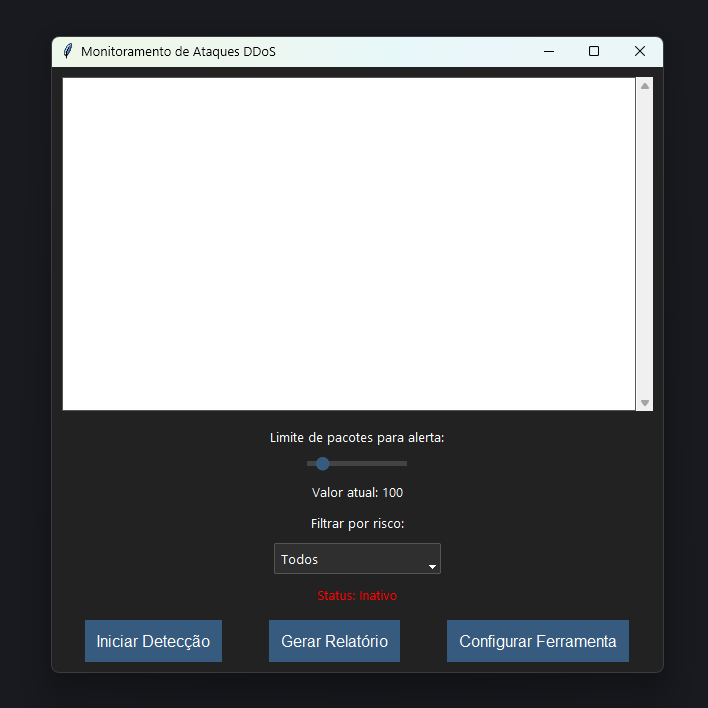

# Monitoramento_ddos

---

### 1. Introdução

Bem-vindo ao repositório da **Ferramenta de Detecção de Ataques DoS/DDoS**! Este repositório contém o código-fonte da aplicação que monitora o tráfego de rede em tempo real para detectar ataques DDoS. O projeto é construído com Python e inclui uma interface gráfica para fácil configuração e uso. A **ferramenta de detecção de ataques DoS/DDoS** é uma aplicação projetada para monitorar o tráfego de rede em tempo real e identificar atividades suspeitas que possam indicar a ocorrência de um ataque de negação de serviço distribuído (DDoS). A ferramenta utiliza técnicas de inspeção de pacotes para analisar o tráfego e alertar os administradores sobre possíveis ameaças, permitindo uma resposta rápida para mitigar ataques.

### Objetivos

**Detecção em Tempo Real**: Monitorar o tráfego de rede para identificar ataques DDoS assim que eles ocorrem.

**Interface de Usuário Intuitiva**: Fornecer uma interface gráfica (GUI) que permita a configuração, visualização de logs, e geração de relatórios de eventos.

**Flexibilidade e Configurabilidade**: Permitir que os administradores configurem os parâmetros de detecção, como portas monitoradas e IPs ignorados.

**Funcionalidades Implementadas:**

1. **Detecção de Ataques DDoS:** O módulo `detector.py` utiliza a biblioteca `scapy` para capturar pacotes de rede e identificar possíveis ataques DDoS. A detecção é baseada em um limite de pacotes por IP que, quando excedido, gera um alerta.
2. **Monitoramento de Logs:** O módulo `logger.py` registra eventos de segurança e informações do sistema em arquivos de log. Os logs são categorizados por nível de risco.
3. **Interface Gráfica:** O módulo `gui.py` utiliza a biblioteca `tkinter` com o `ttkbootstrap` para criar uma interface gráfica moderna. A interface permite iniciar/parar a detecção, configurar parâmetros, gerar relatórios, e visualizar logs.
4. **Geração de Relatórios:** A aplicação gera relatórios em PDF dos eventos de segurança, utilizando a biblioteca `reportlab`.


 


### 2. Configuração Inicial

#### 2.1. Clonando o Repositório

Para começar a trabalhar com o projeto, você precisará clonar o repositório para o seu ambiente local. Execute o seguinte comando:

```bash
git clone https://github.com/seu-usuario/nome-do-repositorio.git
```

#### 2.2. Instalando Dependências

1. Navegue até o diretório do projeto e instale as dependências necessárias com o `pip`:

```bash
cd nome-do-repositorio
pip install -r requirements.txt
```
2. **Configuração:** Execute `app.py` e insira as configurações necessárias para a rede e sistema.
3. **Iniciar Detecção:** Clique no botão "Iniciar Detecção" na interface gráfica.
4. **Visualizar Logs:** Os logs são exibidos em tempo real na interface.
5. **Gerar Relatório:** Utilize o botão "Gerar Relatório" para criar um PDF com os eventos registrados.

### 3. Comandos Git Essenciais

Aqui estão alguns comandos Git essenciais para ajudar a gerenciar seu trabalho no repositório:

- **Clonar o Repositório**: `git clone <URL do repositório>`
- **Verificar Status**: `git status`
- **Adicionar Arquivos**: `git add <arquivo>`
- **Fazer Commit**: `git commit -m "Mensagem do commit"`
- **Puxar Alterações**: `git pull`
- **Enviar Alterações**: `git push`
- **Criar uma Nova Branch**: `git checkout -b nome-da-branch`
- **Mudar de Branch**: `git checkout nome-da-branch`
- **Mesclar Branches**: `git merge nome-da-branch`

### 4. Fluxo de Trabalho Git

Para garantir um fluxo de trabalho suave e evitar conflitos de código, siga estas etapas ao contribuir para o projeto:

1. **Atualize seu Repositório Local**: Antes de começar a trabalhar, certifique-se de que seu repositório local está atualizado com as últimas alterações do repositório remoto.

    ```bash
    git pull origin main
    ```

2. **Crie uma Branch para suas Alterações**: Crie uma nova branch a partir da branch `main` para suas alterações. Nomeie a branch de forma descritiva, usando a convenção `tipo/descrição`, por exemplo, `feature/detector-improvements`.

    ```bash
    git checkout -b feature/nova-funcionalidade
    ```

3. **Faça Commit de suas Alterações**: Após concluir suas alterações, adicione e faça commit dos arquivos modificados.

    ```bash
    git add .
    git commit -m "Descrição das alterações realizadas"
    ```

4. **Envie sua Branch para o Repositório Remoto**: Envie sua branch para o repositório remoto para iniciar o processo de revisão.

    ```bash
    git push origin feature/nova-funcionalidade
    ```

5. **Crie um Pull Request (PR)**: No GitHub, navegue até o repositório e crie um Pull Request da sua branch para a branch `main`. Descreva as mudanças que fez e solicite uma revisão.

6. **Revisão de Código**: Aguarde a revisão dos mantenedores do projeto. Faça qualquer alteração necessária com base no feedback.

7. **Mesclar o Pull Request**: Após a aprovação do PR, ele será mesclado na branch `main`.

### 5. Diretrizes para Contribuição

Para manter a qualidade e a consistência do código, siga estas diretrizes ao contribuir para o projeto:

- **Código Limpo e Bem Documentado**: Escreva código que seja fácil de ler e mantenha a documentação atualizada.
- **Testes**: Sempre que possível, adicione testes para as novas funcionalidades ou correções de bugs.
- **Commits Granulares**: Faça commits pequenos e focados, que sejam fáceis de entender e reverter, se necessário.
- **Respeite o Estilo do Código**: Siga o estilo de codificação PEP8 para Python e quaisquer outras convenções definidas no projeto.

### 6. Estrutura do Repositório

A estrutura básica do repositório é a seguinte:

```
/nome-do-repositorio
│
├── /backend               # Código backend para detecção de ataques
│   ├── detector.py        # Lógica central para detecção de ataques DDoS
│   └── logger.py          # Módulo de monitoramento de logs
│
├── /frontend              # Código frontend para a interface gráfica
│   ├── app.py             # Script principal para iniciar a GUI
│   └── gui.py             # Código da interface gráfica do usuário
│
├── /tests                 # Testes automatizados
│   └── test_detector.py   # Testes para o módulo de detecção
│
├── requirements.txt       # Dependências do projeto
└── README.md              # Documentação principal do projeto
```

### 7. Manutenção e Atualização

Manter o repositório atualizado é fundamental para o desenvolvimento contínuo do projeto. Siga estas práticas para manter o repositório saudável:

- **Sincronize Regularmente**: Antes de começar a trabalhar, sempre sincronize seu repositório local com a branch `main`.
- **Revise e Refatore**: Regularmente, revise o código e refatore-o para melhorar a eficiência e a legibilidade.
- **Documente Mudanças**: Atualize a documentação sempre que fizer mudanças significativas no código.

---

Sinta-se à vontade para abrir uma **Issue** se encontrar algum problema ou tiver sugestões para melhorar a ferramenta. Agradecemos sua contribuição!
